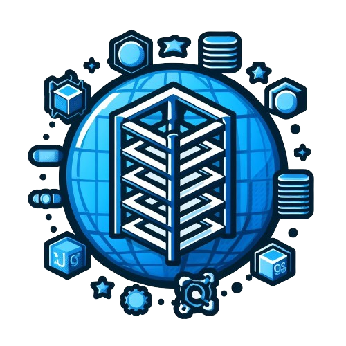

<h1>Flame Framework</h1>

a Simple MVC Framework ligthweight

Routing & Streaming
- Filebase routing and Defined routing
- Inbuilt Http Stream Request

Authentication 
- Secure Basic Auth : crypted password and session 
- Oauth : (plan)
- JTW : (plan)

Database
- MySQL : currently the only database supported
- MSSQL : (plan)
- PosgeSQL : (plan)

Email Option
- Native
- SendMail
- PhpMailer
- curl : (plan)

Included support for Console
- Websocket
- Cronjob : (plan)
  
Added Support
- Htmx : for inline Ajax Request
- React : (plan)
- Vue : (plan)
- Angular : (plan)
- Firebase : (plan)
- jQuery

  

     
     

     

       Written by: Christian Balais
     

